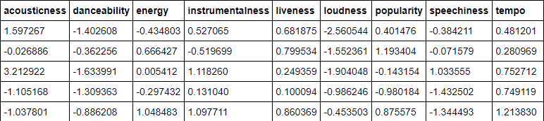
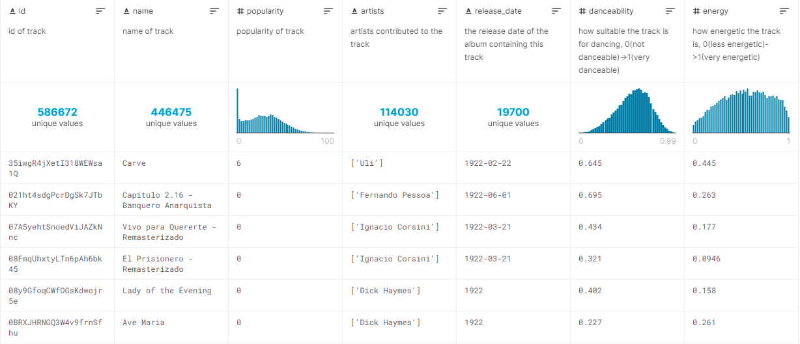

# Project Overview
Hi! Welcome! Our project entails creating a music recommendation website. We are using machine learning to analyze song characteristics and recommend 3-5 songs based on the distance from the original input song.

Presentation Slides: https://docs.google.com/presentation/d/1fenD0qLnxMxOIn_bhs8PUaC3YdDqmv0f-JdH6nSpv7U/edit?usp=sharing

Storyboard Slides: https://docs.google.com/presentation/d/1UO--Mb5cc4-dj-lo2UrzN9U1MlOCjZQdRbD1l1JphEc/edit?usp=sharing

Our App: https://findmefm.herokuapp.com/

## Hypothesis and Goals
### Hypothesis
- Can machine learning predict what songs a user will enjoy based on the audio features of songs they like?

## Project Description
### Technologies Used
#### Data Cleaning and Analysis
Cleaning and analysing the data will be done using Pandas through Python in Jupyter Notebook. 

#### Database Storage
Our database will be stored and managed in SQL using Postgres. 

### Machine Learning
Using the SciKitLearn Python library we will develop, test, and train our model. 
##### Description of How Data Will Be Split in Testing
We are using the magnitude formula to determine the magnitude of the features of the input song. The output(s) will be songs with the least distance/difference from the input song. As a control, we will run that testing with random song selection to see if the recommendations of the model are "liked" by users more significantly. Our team will test both recommendation models. 

##### Explanation of Model Choice
We chose to use the computed magnitude of each song's audio features which were processed with a PCA analysis. Other features like a song's length, date of release, and other non-audio feature's weren't considered. The idea is that the magnitude will place individual songs next to each other when sorted by their magnitude value. This will help to find songs that the user will like. The downfall of this is that a song could have vastly different traits but could end up having similar magnitudes.

As we are calculating magnitude from the features returned from the PCA analysis, no training was necessary. However, what will be changed is tweaking each feature's coefficients when calculating the magnitude for each song.

### Dashboard
We are using Tableau build visualizations and Flask to deploy our model through an interactive dashboard using Python and HTML. Heroku will be used for app hosting. 

### Data Source
Our primary data source is the Kaggle dataset titled Spotify Dataset 1922-2021, ~600k Tracks which contains information and audio feature measurements fon tracks and artists obtained using the Spotify API.

### Questions For Further Study
- Can we predict an artist's most popular song based on audio elements?
- Can we predict the most popular song off an album based on audio elements?
- Can we use audio elements to predict a song a listener would like?
- Can we use audio elements of an artist to predict another artist a listener would like?
